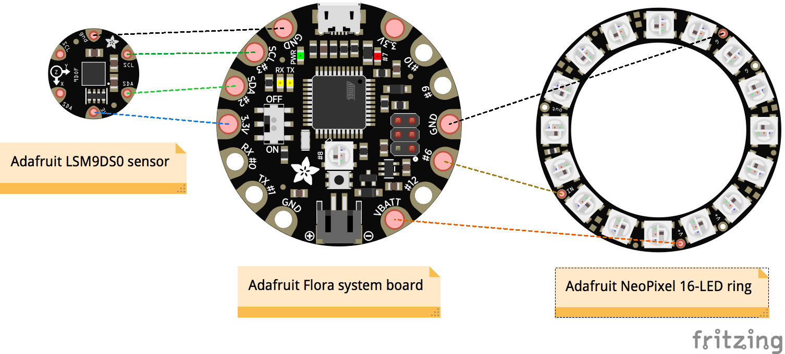
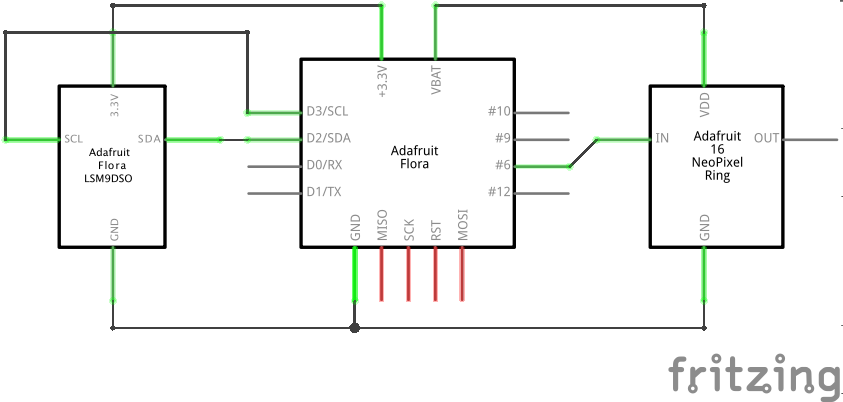

# Cestus

## Introduction

This is a software & hardware project for an automatic orientation-controlled turn & stop light mounted on bicycle gloves. Hence, the name [___cestus___](https://en.wikipedia.org/wiki/Cestus): the Latin word for a ___battle glove___ used by boxers and gladiators of ancient Greece and Rome. Seems appropriate, given how dangerous it can be to share the road in the U.S.

## Hardware Parts

| Part | Cost |
| ---- | ---: |
| [Adafruit Flora v3](https://www.adafruit.com/product/659) system board | $14.95 |
| [Adafruit LSM9DS0](https://www.adafruit.com/products/2020) sensor board | $19.95 |
| [Adafruit NeoPixel Ring 16](https://www.adafruit.com/products/1463) multicolor LEDs | $9.95 |
| [Adafruit LiPoly 150mAh Battery](https://www.adafruit.com/products/1317) | $5.95 |
| **TOTAL** | **$50.80** |

In addition, you'll need a bicycle glove (or really any glove) and some [1&frac12;" diameter clear heat shrink tubing](http://www.frys.com/product/3222541). When flattened, the heat shrink tubing is about 2" wide and fits nicely around the Flora board stacked with the NeoPixel ring.

Note that these only make up one __cestus__ glove. If you build two, they operate independently of each other. While this is perhaps not the most cost-effective option, it wasn't a huge concern for me.

Some alternatives to consider for a more cost-effective solution:

* I used the Adafruit Flora system board even though a less powerful (and smaller) system board would suffice: for example, [Adafruit Gemma v2](https://www.adafruit.com/product/1222). The challenge is that doing so would require substantial re-factoring of the stock Adafruit libraries, in particular trading off flexibility and portability in favor of reduced code size. Gemma has only about 5KB of code space, and the project as currently written compiles to about 15.5KB (Flora has about 28.5KB available). Additionally, Gemma (based on ATtiny85) is not officially supported by the [LSM9DS0 sensor library](https://github.com/adafruit/Adafruit_LSM9DS0_Library) though I believe it ought to work.
* I used the Adafruit LSM9DS0 sensor board even though it was a complete overkill as I really only needed the accelerometer for this project. You could use one of the cheaper sensors with less features: for example, [Adafruit LSM303](https://www.adafruit.com/products/1247) or [Adafruit LIS3DH](https://www.adafruit.com/products/2809).

## Hardware Assembly

The hardware wiring is pretty straightforward, as illustrated below. You could use another pin instead of `D6` for the NeoPixel ring, but doing so will require changing the `CONF_NEOPIXEL_PIN` constant in the code.

## Software Pre-requisites

You will need to install the [Arduino IDE](https://learn.adafruit.com/adafruit-arduino-ide-setup/arduino-1-dot-6-x-ide) or equivalent development environment. In addition, you will need to install the following Arduino libraries:

1. [Adafruit Unified Sensor Library](https://github.com/adafruit/Adafruit_Sensor)
2. [Adafruit LSM9DS0 Sensor Library](https://github.com/adafruit/Adafruit_LSM9DS0_Library)
3. [Adafruit AHRS (Altitude and Heading Reference System) Library](https://github.com/adafruit/Adafruit_AHRS)
4. [Adafruit NeoPixel library](https://github.com/adafruit/Adafruit_NeoPixel)
5. [NeoPatterns library](https://github.com/tjotala/NeoPatterns) which I adapted from the original [Adafruit NeoPatterns](https://learn.adafruit.com/multi-tasking-the-arduino-part-3/using-neopatterns) library to better suit my needs and enable easier enhancements. The original library is not in GitHub, otherwise I would have forked it.

## Building the Software

1. Download the [code](https://github.com/tjotala/Cestus) -or- clone the repo: `git clone https://github.com/tjotala/Cestus.git`
2. Launch the Arduino IDE
3. Open the sketch: `File` -> `Open...`
3. Build the code: `Sketch` -> `Verify/Compile`

## Uploading Code to the Device

1. Connect the device to a free USB port
2. Configure the Arduino IDE for Flora using the `Tools` menu:
   1. Under `Board`, select `Arduino Flora`
   2. Under `Port`, select the appropriate USB port (on a Mac, it is named something like `/dev/cu.usbmodemNNN`)
3. Upload the code: `Sketch` -> `Upload`

## Operation

Once the device is powered ON, it will respond to the following motions from the level orientation - that is, if your gloved hand is flat on a table with the palm down.

1. Tilt the device **sideways** in either direction (i.e. 90&deg; from level), and it will animate a turn signal consisting of a _scanner_ pattern of red LEDs. This is similar to the back-and-forth swoosh of the [Knight Rider car](https://www.youtube.com/watch?v=54O_1mOab4Y), or the [Cylon warrior "eye"](https://www.youtube.com/watch?v=0ccKPSVQcFk) from Battlestar Galactica.
2. Tilt the device **straight up** (i.e. 90&deg; upward from level), and it will animate a stop signal consisting of red LEDs being turned alternatively ON and OFF (apparently known as _theater chase_ pattern).
3. Tilt the device **straight down** (i.e. 90&deg; downward from level), and it will animate a go signal consisting of white LEDs pulsating ON and OFF (I coined the name _pulsar_ pattern).

## Tweaking the Software

1. The `CONF_USE_DEBUG_OUTPUT` and `CONF_DEBUG_OUTPUT_SPEED` constants control whether to send debug output messages to the host Mac/PC over serial connection, and how fast to do it. Turning this OFF (the default) saves couple of KB of code space.
2. The `CONF_BLINK_ONBOARD_LED` constant controls whether to blink the on-board LED each time the code samples the orientation sensor. Given that the LED is on the underside of the device, this is purely for debugging purposes.
3. The `CONF_TURN_xxx` constants control the orientation tolerance, timing, colors, etc. of the turn signal.
4. The `CONF_STOP_xxx` constants control the orientation tolerance, timing, colors, etc. of the stop signal.
5. The `CONF_GO_xxx` constants control the orientation tolerance, timing, colors, etc. of the go signal.
6. The `CONF_ONBOARD_LED_PIN` constant defines which digital pin connects to the on-board LED. On the Flora board, this is always 7.
7. The `CONF_ONBOARD_NEOPIXEL_PIN` constant defines which digital pin connects to the on-board NeoPixel LED. On the Flora board, this is always 8.
8. The `CONF_NEOPIXEL_PIN` constant defines which digital ping connects to the NeoPixel ring, and the `CONF_NEOPIXEL_LEDS` constant defines how many LEDs there are in the NeoPixel ring/strip.
