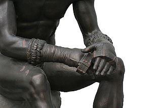
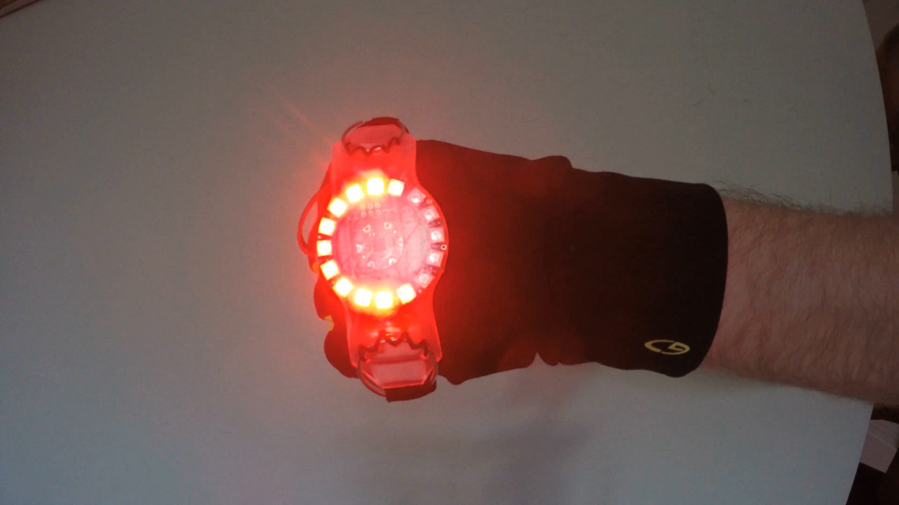
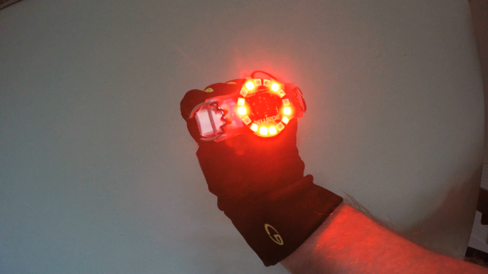
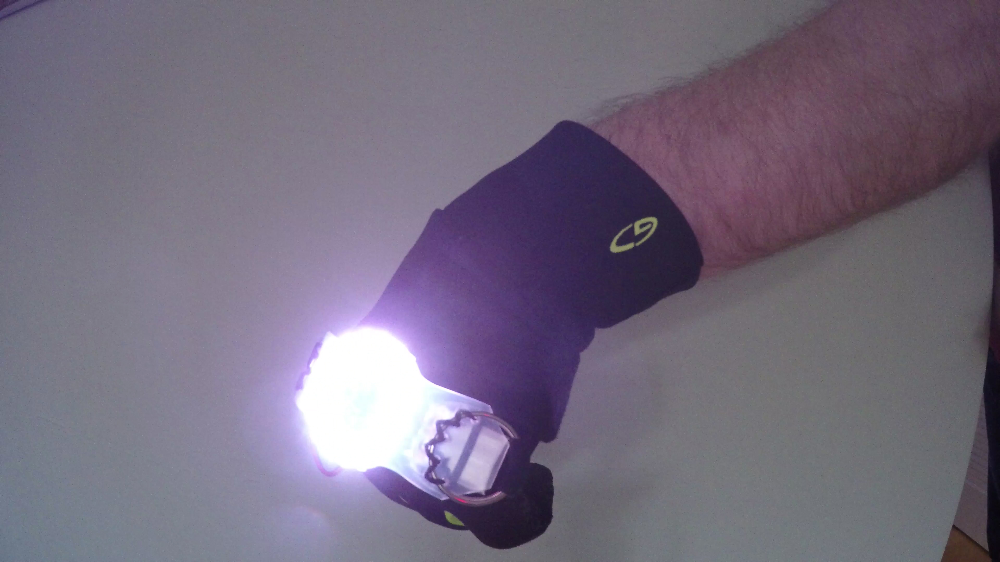
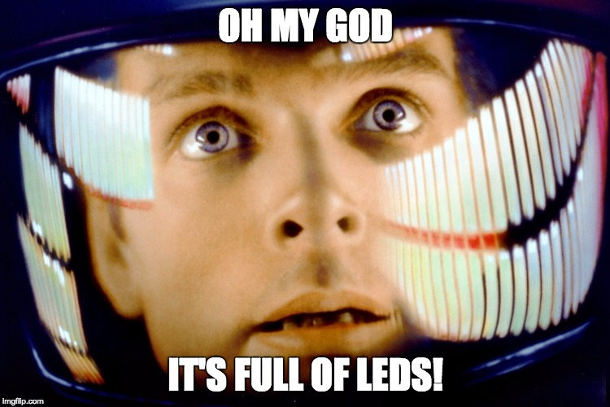
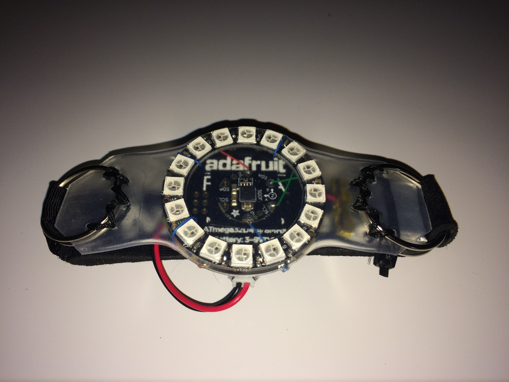
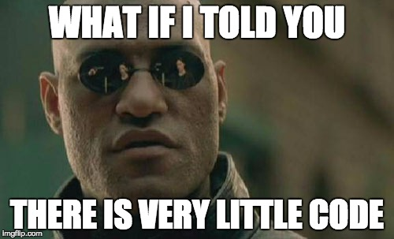

# I Have Seen The Light... and It Is Smarter

Something has always bothered me about bicycle lights: they are fundamentally dumb. No, I do not mean that they are useless - but rather how they are not adaptive to our riding behavior. There is no way to indicate intent as we do with the turn signals and brake lights in a car.

## Solution

A while back I decided to solve this problem when I resumed bicycling for exercise. I named the solution [___cestus___](https://en.wikipedia.org/wiki/Cestus), after the Latin word for an armored ___battle glove___ used by boxers and gladiators of ancient Greece and Rome. It seemed only appropriate given how dangerous it can be to share the road in the U.S.

credit: [wikimedia](https://upload.wikimedia.org/wikipedia/commons/thumb/7/70/Boxer_of_quirinal_hands.jpg/320px-Boxer_of_quirinal_hands.jpg)

The idea is to attach this smarter bicycle light to the back of hand of a regular biking glove, and do what feels fairly natural:

* When I extend my arm to the left or right with the palm facing forward, it animates a red turn signal.
* When I extend my arm straight up, it flashes all the LEDs as a red stop signal.
* When I extend my arm down or simply tilt my wrist down, it turns into a flashing bright white headlight.

The tolerance for those positions is fairly loose, &plusmn;30&deg; from the 90&deg; orientation, to accommodate sloppy signaling.

The videos below illustrate this much better than my words.

### Turn Signal

### Stop Signal

### Headlight

## Hardware

The proof-of-concept system consists of four components developed by [Adafruit] for wearable designs:

1. An [Arduino]-compatible system board
2. A sensor board
3. A highly visible ring of 16 multicolor LEDs
3. A small rechargeable LiPoly battery

The total cost of the parts is around $50, and with one charge of the battery it runs for about 30-60 minutes depending on usage. I could have used a higher capacity battery but my bicycle rides are simply not long enough to justify it.

If I were to productize this solution, I could substantially reduce the cost with less expensive parts and tighter system integration. Unlike it's ancient name sake, I chose not to encase it in armor or leather due to both weight and cost considerations. I thought of 3D printing a case for the light, but ultimately simply wrapped it in clear heat shrink tubing to protect it from the elements. In addition, I chose to mount the device on a neoprene strap that I can then slip over my hand, rather than sew it directly onto the back of the glove. This has the added benefit of being able to use it without a glove, like in the middle of scorching California summer, and makes it easier to wash the gloves.

## Software

The software is very simple: there's only about 100 lines of actual C++ code, aside from existing [Adafruit] libraries. As with any [Arduino] application, there are two functions:

* The `setup` function is called at power on exactly once to initialize everything
* The `loop` function gets called repeatedly until power off. It samples the orientation sensor in the beginning of each iteration, and then switches between four possible states:

	1. Begin animating a new signal
	2. Continue animating a previously chosen signal
	3. Stop animating a signal
	4. Do nothing

## Technical Details

The source code and wiring diagrams are freely available in a [github][repo] repository under MIT license. If you are interested in more technical details, check out the [README][repo].

## Conclusion

This was a fun little project. As usual for me, the software was simple and the toughest part was figuring out how to package the hardware in a way that is easy to use, easy to attach to a glove, and robust enough to handle the harsh California weather. Why, we sometimes even get rain around here!

## Enhancement Ideas

The sensor board I used can also measure acceleration, compass heading and temperature. I only needed the orientation for this project as currently implemented. I was tempted to automatically turn on the stop signal automatically based on sudden deceleration. I thought of making the ring LED briefly show a heading indicator if flicked in a certain way, or perhaps do something cute with the temperature data. I could also make something like interval timer or elapsed time by turning on sections of the LEDs.

Ultimately I decided against all those ideas, because of their limited utility. Without moving your hand, automating the stop signal would not be visible to anyone behind you. As for the compass heading indicator or temperature, I simply did not see much utility in them. I do not bike far enough for the heading to matter, and my skin can readily tell if it is cold or hot. The timer features might come in handy but then most of the time I bike with a smartphone that acts as GPS tracker so I have no need for additional clock sources.

Speaking of GPS, it would be fairly easy to add a GPS receiver to this device as well, but that would substantially increase the cost and power consumption, not to mention create further problems with where to store the location data and how to offload it. In short, it creates more problems than it solves: a classic case of "just because we can, we should not". Put another way, don't draw legs on the snake as the Chinese proverb goes.

[Arduino]: https://www.arduino.cc/
[Adafruit]: https://www.adafruit.com/
[repo]: https://github.com/tjotala/cestus
